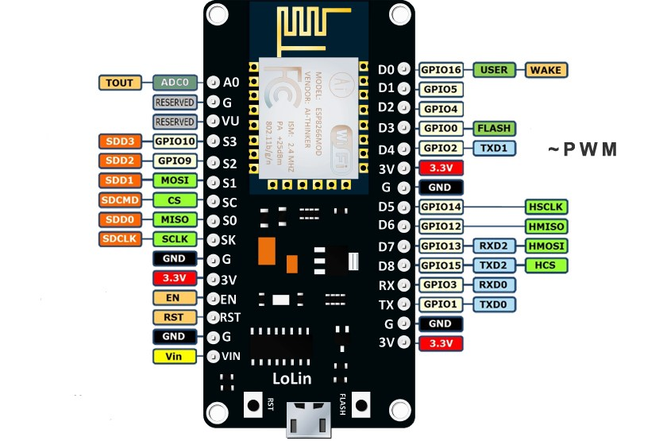
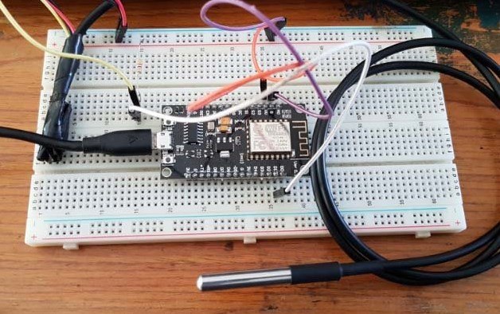
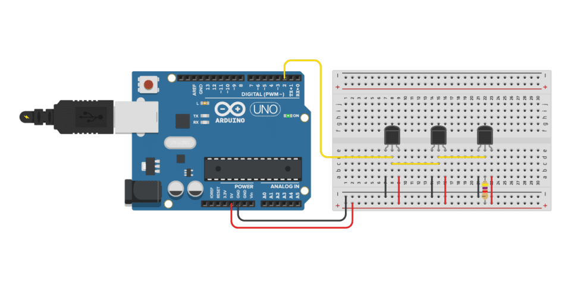
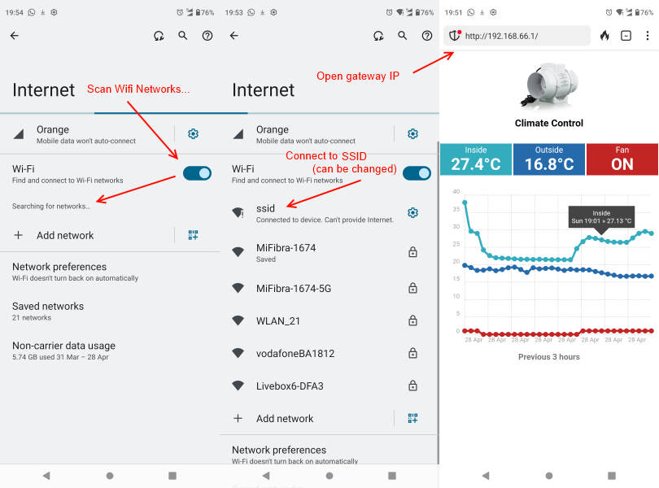
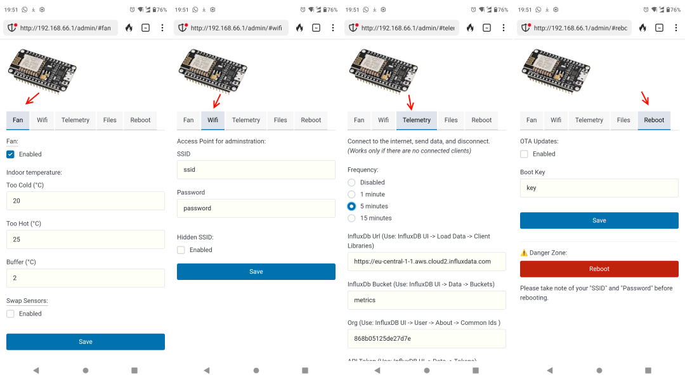
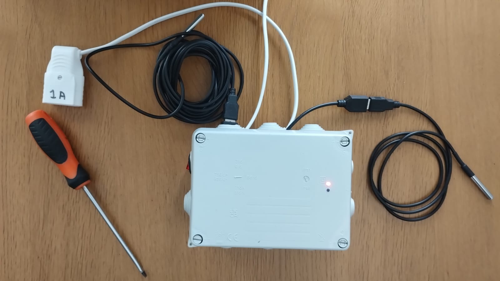
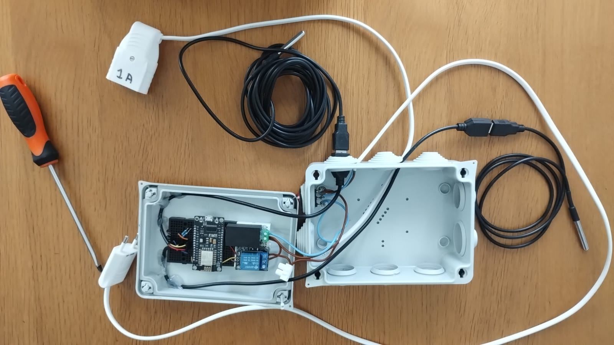
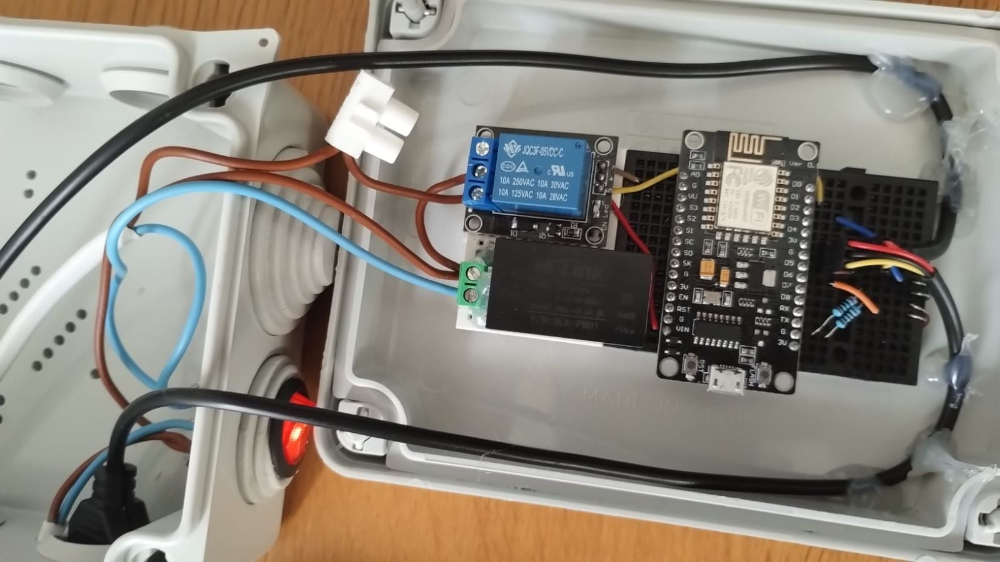

# ESP8266 Climate Control circuit (Fan + Thermostat)

This is a climate control circuit to use external temperature to regulate indoor temperature.

# Components

- 1x ESP8266 Nodemcu (V3)
- 2x DS18B20 waterproof temperature sensors
- 1x 25W 100mm inline "duct" fan mounted on external air conduit
- 1x 5V relay for 220V AC

## 1x ESP8266 Nodemcu (V3)

The great thing about the [ESP8266](https://en.wikipedia.org/wiki/ESP8266) microcontroller is the in-built WiFi. A fully-featured board such as the [NodeMCU V3](https://www.theengineeringprojects.com/2018/10/introduction-to-nodemcu-v3.html) will sell for aprox 3EUR/4USD on Aliexpress, and it contains a 160MHz microcontroller with 64KB RAM and a 4MB flash drive.

WiFi support (AP and STA modes) will allow you to have an admin interface controllable from your phone, as well as send periodic telemetry updates via internet to track indoor/outdoor temperatures. You can also use [ESP32](https://en.wikipedia.org/wiki/ESP32) also but I prefer the older chip for greater library compatibility.

## 2x DS18B20 waterproof temperature sensors

These temperature sensors are great to work with. You can buy them in 1-5m length.

## 1x 25W 100mm inline "duct" fan

You can buy these off amazon for around 35 EUR / 40 USD.

## 1x 5V relay for 220V AC

A relay module allows you to switch a 220V AC appliance such as a duct fan.

You can use a 5V or 3V module depending on preference. The circuit will support both.

## Hookup (Multi Sensor)

Using the "OneWire" protocol its possible to hook up multiple sensors on the same signal line, with a pull-up resistor at 5K (or 10K) ohm.

# Features

1. Graph-based UI showing indoor/outdoor temperatures
2. Admin Web UI to configure temperatures and enable fan.
3. Admin Web UI to configure Wifi settings
4. Admin Web UI to configure Telemetry settings (InfluxDb)
5. Admin Web UI to show local flash drive capacity
6. Factory reset on FLASH button
7. Remote REBOOT via Admin UI

## Connect via Wifi and open Graph Based UI

## Admin Web UI

# Testing

## Breadboard

Version 1 is breaboarded, for integration testing.

