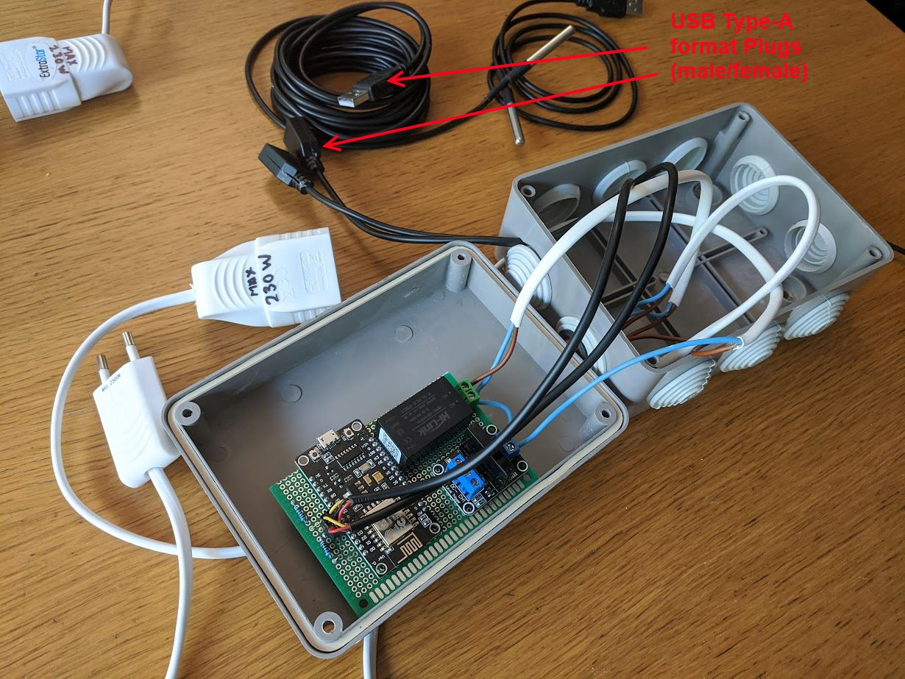
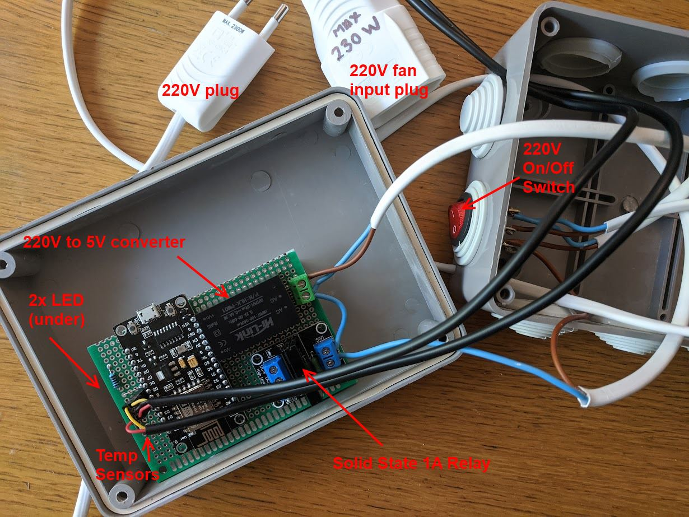
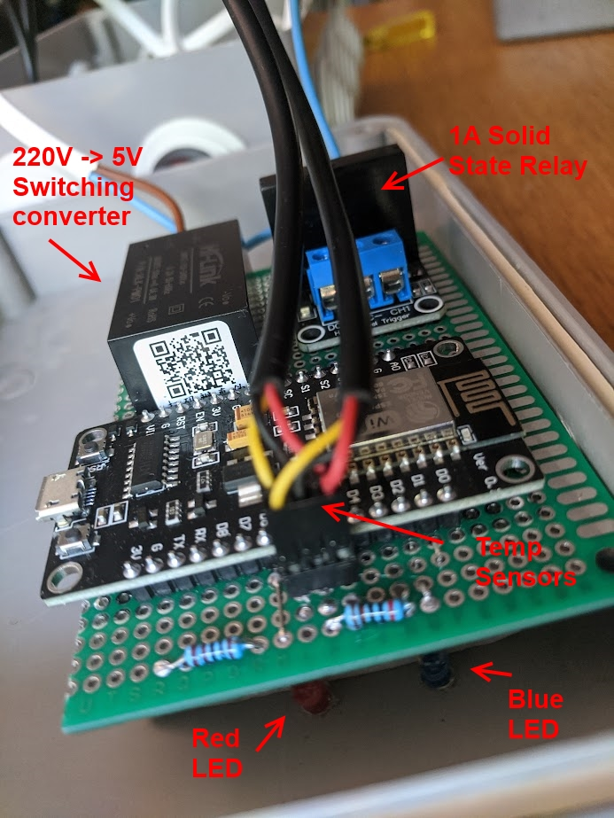
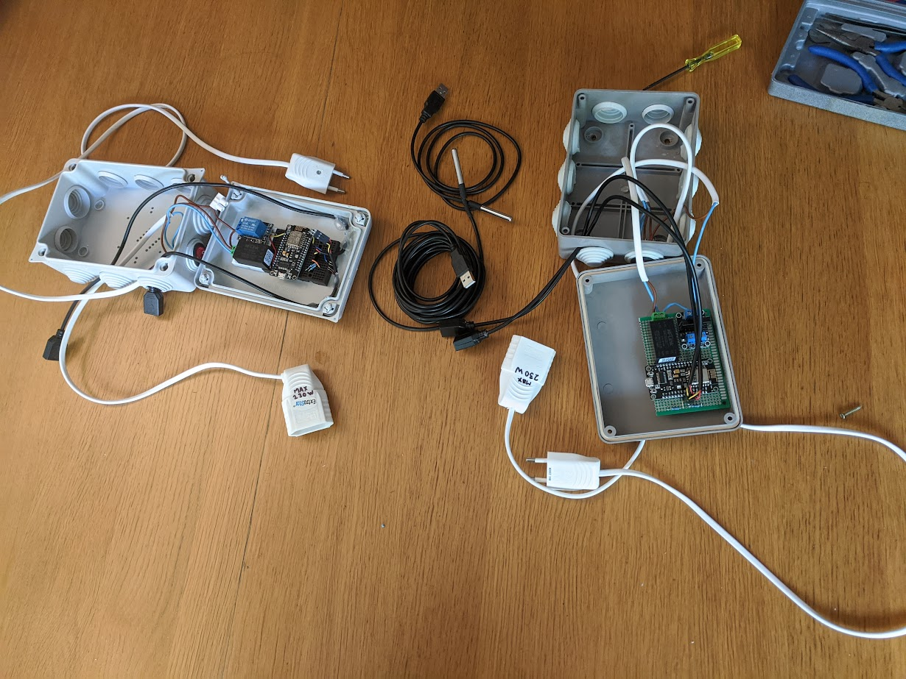

# ESP8266 Climate Control circuit (Fan + Thermostat)

This is a climate control circuit to use external temperature to regulate indoor temperature.

# Components

- 1x ESP8266 Nodemcu (V3)
- 2x DS18B20 waterproof temperature sensors
- 1x 25W 100mm inline "duct" fan mounted on external air conduit
- 1x 5V relay for 220V AC

## 1x ESP8266 Nodemcu (V3)

The great thing about the [ESP8266](https://en.wikipedia.org/wiki/ESP8266) microcontroller is the in-built WiFi. A fully-featured board such as the [NodeMCU V3](https://www.theengineeringprojects.com/2018/10/introduction-to-nodemcu-v3.html) will sell for aprox 3EUR/4USD on Aliexpress, and it contains a 160MHz microcontroller with 64KB RAM and a 4MB flash drive.

WiFi support (AP and STA modes) will allow you to have an admin interface controllable from your phone, as well as send periodic telemetry updates via internet to track indoor/outdoor temperatures. You can also use [ESP32](https://en.wikipedia.org/wiki/ESP32) also but I prefer the older chip for greater library compatibility.

## 2x DS18B20 waterproof temperature sensors

These temperature sensors are great to work with. You can buy them in 1-5m length.

## 1x 25W 100mm inline "duct" fan

You can buy these off amazon for around 35 EUR / 40 USD.

## 1x 5V relay for 220V AC

A relay module allows you to switch a 220V AC appliance such as a duct fan.

You can use a 5V or 3V module depending on preference. The circuit will support both.

## Hookup (Multi Sensor)

Using the "OneWire" protocol its possible to hook up multiple sensors on the same signal line, with a pull-up resistor at 5K (or 10K) ohm.

# Features

1. Graph-based UI showing indoor/outdoor temperatures
2. Admin Web UI to configure temperatures and enable fan.
3. Admin Web UI to configure Wifi settings
4. Admin Web UI to configure Telemetry settings (InfluxDb)
5. Admin Web UI to show local flash drive capacity
6. Factory reset on FLASH button
7. Remote REBOOT via Admin UI

## Connect via Wifi and open Graph Based UI

## Admin Web UI

# Testing

## Breadboard

Version 1 is breaboarded, for integration testing.

# Deployment

## Soldered breadboard (final version)

Version 2 is soldered together. So I dont have care too much if it gets banged up a bit.

In the end I used a [Solid-State Relay](https://www.aliexpress.com/item/32838242762.html) that can handle up to 2A (1A safely).
I was warned by a very experienced electronics engineer to be careful with solid state relays since you dont want 220V current 
to ever mix in with low-power 5V electronics. Sooner or later something will give in and your electronics project
will instantely get turned into a black sticky mess and a puff of smoke.

Fortunately, as cheap as the aliexpress solid-state relays are, they use an optocoupler internally, meaning that there is no direct connection between circuits. Instead you get a small IR photo-sensor triggering the 220V pass-through circuit which is pretty safe, and most importantly, the failure state is NOT a black sticky mess, but simply the 220V circuit not turning on at all.

I also used USB Type-A for the temperature sensors, which makes replacement very easy. So if I ever have to update the control unit I do not need to pull the sensor cables, just unplug them as you would any other computer peripheral.

## Side-by-side

I am keeping both versions together, the final version will be the primary, and the test prototype will be used as backup.

It actually makes a lot of sense to have 2 copies of the fininshed product, since the cost of development is prohibitive compared to the electronics components that I need to put another one together.

I've probably spent close to 80 hours in total developing and testing, that would be around 5K+ EUR at market rates. Whereas
the electronics components cost about 15-20 EUR aproximately per unit. 

